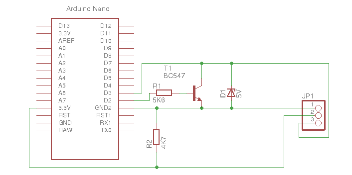

# Arduino-LANC
Arduino based LANC to serial converter.

## Building
Both of the input and output directories contain a makefile that uses gcc-avr and avrdude. Installing the arduino framework on your system should be sufficient to install the dependencies.

## Output
[Source](output/)   
This is the most common use case, which allows for the arduino to act as a LANC controller and connect to a compatible camera.   
It expects a very simple ASCII protocol:
eg. ```#28-0E``` will send a zoom in command

### Circuit
Note: The connection from the lanc cable to arduino pin RAW (VIN) is not required if the arduino powered elsewhere.   


## Input
[Source](input/)   
This allows for receiving commands from an existing LANC controller.
It will output data in the format ```#28-0E``` when it is received from the controller.

### Circuit


## References
A full list of LANC commands can be found at: http://www.boehmel.de/lanc.htm  
Based on the work by Martin Koch at: https://controlyourcamera.blogspot.co.uk/2011/02/arduino-controlled-video-recording-over.html
